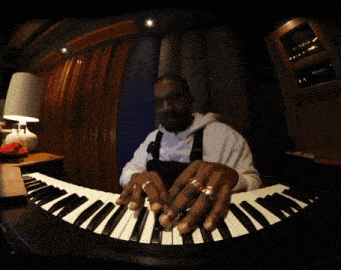

 

<!--
    Your own Terminal GIF can be created here -> https://www.terminalgif.com
-->

    
    

<!--
     My mission, because I'm a superhero!
-->

### Ya gotta love it
I love music (creating it, listening to it, sharing it, everything) but I also have had a great fascination for apps and building businesses, which has led me to the programming side of things as well. Perhaps I can combine the two, makin' those dreams come true~
<!--
     This is the list of my skills and tools I am studying!
-->

### Main skills

### My Music!

    
    
    

### Connect with me!

    
    

<!--
     Oh, hello there, recruiters!
-->

### Art thee a recruiter?
> [⬇⬇⬇⬇⬇⬇⬇]  
> <a href="https://drive.google.com/file/d/1IylGo2bjftCHd_RbFIjjcjKbS601U5-W/view?usp=sharing" download>Download my Resume!</a>

<!--
     Thanks for being my guest <3
-->
